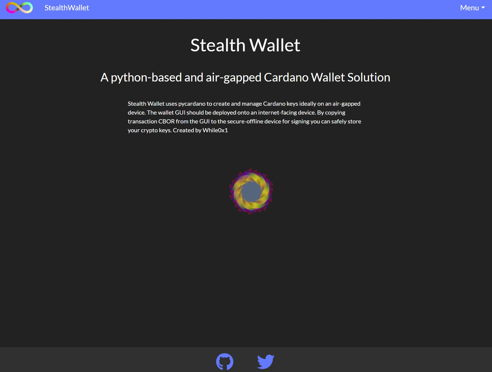

#A Cardano wallet interface written predominantly with Dash and Pycardano.

#You will need a cardano-node with ogmios or a blockfrost key to use this tool.
#To import keys through the menu -> wallet -> keys UI the keys must be named payment.vkey, payment.skey, and if you are also importing stake keys they must be named stake.skey and stake.vkey
#All keys must be loaded at the same time! - You can drag and drop multiple files into the key upload window. 

##IMPORTANT NOTE!!
# StealthWallet does not support native token Decimals currently - you need to use the correct scaling derived from the cardano token registry for sending native assets!!



## Build 


Please refer https://blockfrost.io/  for generating mainnet and preprod keys 
=======
BF_MAINNET=<mainnet...>\
BF_PREPROD=<preprod...>\
NETWORK=MAINNET\
COLD_ADDRESS=\
EXCLUDE_UTXOS={}

#if excluding utxos from spending the following format should be followed:
    #EXCLUDE_UTXOS='{"addr1...":"txHash#txId"}'

cd dash

```
git clone https://github.com/while0x1/stealthWallet.git
cd stealthWallet
pip install -r requirements.txt
```

## Environment 

Create a .env File in the root directory to insert blockfrost keys and to specify UTXOS to exclude from #transactions (collateral UTXOs) 

for mainnet `.env`
```
BF_MAINNET=<mainnet...> 
NETWORK=MAINNET
COLD_ADDRESS=
EXCLUDE_UTXOS={}
```

for preprod `.env`
```mainnet
BF_PREPROD=<preprod...>
NETWORK=PREPROD
COLD_ADDRESS=
EXCLUDE_UTXOS={}
```

if excluding utxos from spending the following format should be followed:
```
EXCLUDE_UTXOS='{"addr1...":"txHash#txId"}'
```

## Run
```
cd dash 
python3 app.py
```
